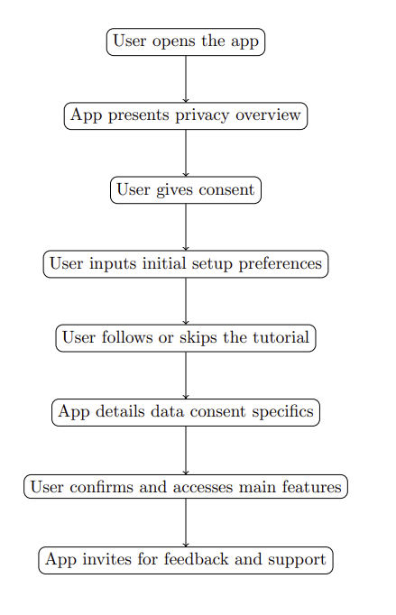
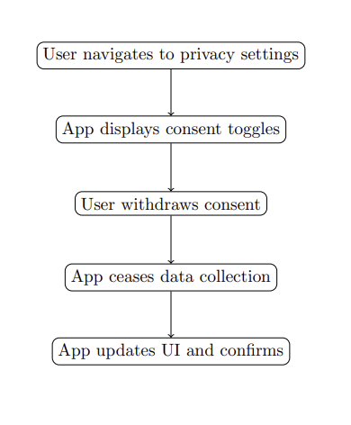
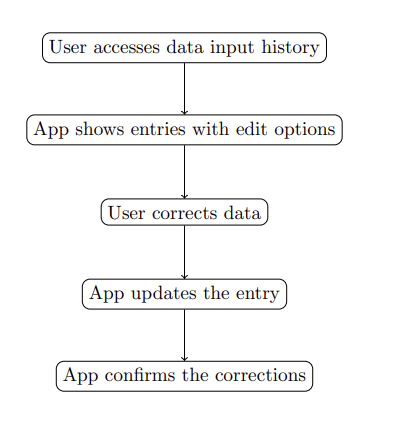
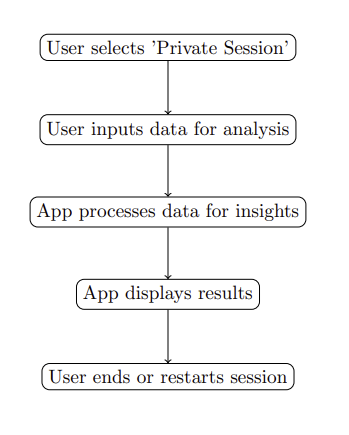

# Alternative Fitness App: Privacy-First Architecture Design

Group 10: Gaby Le Bideau, Jeffrey Kauv Li, Susan Pan, Aybuke Ekiz

Due to privacy concerns with the Fitbit API, we will develop an alternative application that tracks fitness and health data while prioritizing user privacy.

Our application's architecture focuses on user control over personal data. Our goal is to create an alternative fitness app that caters to privacy-conscious fitness enthusiasts, offering health tracking without compromising user privacy.

We aim to make the application entirely local, storing our users' health data manually. The application will not collect any data from users without their knowledge, and users will have to input their fitness and health data manually. Users can pair the application with low-tech, wearable devices like a pedometer, which also do not require the internet. The app will provide users with tools to analyze and visualize their data.

Overall, we aim to create an application that is transparent, user-friendly, and privacy-focused. This document outlines the architectural design decisions and models that will be implemented in the application.

## 1. System Purpose and Scope

The app is a fitness and health tracker that operates entirely offline, prioritizing user privacy. It allows users to manually input their fitness and health data, offering analysis tools without internet dependency. The app's scope includes the following features:

### 1. Consent Management

- Users will be prompted for explicit consent before disclosing health data
- Users will be asked for consent to receive regular notifications for data import reminders and sleep cycle tracking.
- Users will be asked explicit consent to share their location information, different choices (precise location vs approximate location, background or foreground location tracking) will be available.
- In all cases, if the user chooses to not disclose or give permission to anything, the app will still be available.

### 2. Data Input

- The app allows manual data input from various wearable devices (e.g., pedometers, heart rate monitors) and manual input of personal details such as age and weight.
- Users can be prompted to input sleep data for tracking their sleep cycle.
- Users can input exercise data such as walking/running distances.

### 3. Location Tracking

- With user consent, the system accesses location data to track walking/running distances and exercise activities.

### 4. Algorithmic Calculations

- Employing offline algorithms, the application can calculate calories burned using the collected data.

### 5. Privacy Features

- User-centric privacy is ensured through a visible button for easy access to the privacy policy.
- A dedicated section within the app educates users on the privacy implications of their choices, enhancing transparency.

#### Functional Boundaries

- The system's focus centers on health and fitness tracking, deliberately excluding features like social networking and extensive community building.
- It does not include advanced medical diagnostics including blood tests, ECG, temperature monitoring, blood oxygen levels, etc.

## 2. Similar Systems

Here we explore the key differences between our project and more traditional, cloud-based fitness apps.
In general, we see the following behaviour:

### Cloud-Based Fitness Apps

- **Data Storage**: Typically relies on cloud storage, posing potential privacy risks through data breaches or unauthorized access.
- **Data Processing**: Data analysis often occurs on servers, requiring data to be transmitted over the internet.
- **Third-Party Sharing**: It's not uncommon for apps to share data with third parties, either for analytics or advertising purposes.
- **Consent Management**: While some apps do request user consent, the granularity and control over what data is shared can be lacking.

Comparing Fitbit to our specific project here are the main differences:

### Data Anonymization and Security

- **Fitbit**: Collects extensive personal data, which even if it is anonymized can often be re-identified, leading to profiling.
- **Our Project**: Ensures true anonymization by processing and storing all data locally, making re-identification more difficult.

### Third-Party Tracking and Sharing

- **Fitbit**: Data may be shared with third parties for advertising and analytics, potentially exposing users to privacy risks [^1] .
- **Our Project**: Adopts a strict no third-party sharing policy, ensuring user data is never used for advertising or shared with analytics companies.

### Consent and User Control

- **Fitbit**: Offers users some level of control over their data, but navigating privacy settings and understanding consent can be complex.
- **Our Project**: Provides clear, easy-to-navigate consent options, giving users full control over what data is collected and how it's used.

### Local vs. Cloud Data Processing

- **Fitbit**: Relies on cloud-based data processing, which involves transferring user data to servers, increasing the risk of breaches.
- **Our Project**: Processes all data locally on the device, eliminating the need for data transfer and reducing the risk of external breaches.

### Commitment to Privacy

- **Fitbit**: While offering useful health tracking features, has faced scrutiny over its privacy practices [^2] .
- **Our Project**: Designed with a privacy-by-design philosophy, prioritizing user privacy above all else and building trust through transparent practices.

We also came across some similar applications to our app in mind. Here, we explore the differences between our application and the similar ones we found. We will focus on two different applications: Gadgetbridge [^13] and FitoTrack [^14] to compare our application with.

Gadgetbridge: Gadgetbridge is "a free and open source Android application that allows you to pair and manage various gadgets such as smart watches, bands, headphones, and more without the need for the vendor application. So in short, you can use Gadgetbridge instead of relying on your gadget's own proprietary app". It puts a lot of emphasis on privacy, and the fact that it is open-source means that as a user you have access to all the information about what data the app is collecting, what are their privacy rules, and where the data is stored. In many aspects, it looks like a really good app with a great focus on data privacy, and shows us that different ways than relying on Fitbit and Google are possible. However, it still has some limitations that our app will try to address. First of all, it still uses Bluetooth to pair the wearable device with the app, therefore even though the app puts a lot of emphasis on user privacy, user data will still have to travel through Bluetooth and is suspectible to risks that way. Also, because it relies on Bluetooth pairing, and because some devices are nearly impossible to pair to some other app than their main app (like Fitbit), Gadgetbridge only supports a limited amount of devices the user can pair. Our application aims to be wearable device-independent, meaning it will not limit the user to having to wear any specific device. Also, our application aims to be fully offline and local, meaning the user data will never travel through a Bluetooth-like network, and will not be stored in any other place than the user's own local device.

FitoTrack: FitoTrack is a "mobile app for logging and viewing your workouts. Whether you’re running, cycling or hiking, FitoTrack will show you the most important information, with detailed charts and statistics. It is open-source and completely ad-free." It allows the users to track their workouts and view their workouts.
Our application aims to be more similar to FitoTrack than Gadgetbridge, but will allow the user to add data from their wearable devices, rather than relying on "starting" and "stopping" the workout through the application itself. It also aims to support more features to track the user's sleep cycles, weight etc. In summary, our application aims to be on-par and even more privacy focused than these similar applications discussed, and offer most of the important features a wearable device offers.

## 3. Functional Requirements

- **User Interface**:The user interface will be designed to be simple and intuitive, allowing the user to input their fitness and health data easily.
- **Data Storage**: The application will store the user's fitness and health data locally on their device. This data will not be shared with any third parties. The user will not need to create an account either, so the application will truly be device-specific and offline.
- **Data Analysis**: The application will provide the user with tools to analyze their fitness and health data. This will allow the user to gain insights into their health and fitness, without having to share their data with any third parties. All the algorithms used for data analysis will be run offline. For example, to calculate the calories burned in a day, the formula will be stored offline, run offline, and store the data offline.
- **Consent Management**: The application will provide the user with clear and transparent information about what data is being collected and how it is being used. The user will have the ability to provide or withdraw consent for the collection and use of their data at any time. The application will still be accessible even if the user does not give consent for some features. For example, the application will ask for permission to access the user's location. Even if the user declines, the application will be usable, just without the functionalities that would have used the location data.

## 4. Privacy Requirements

1. **Regulatory Compliance:**

   - The application will strictly adhere to the guidelines outlined in the **Personal Information Protection and Electronic Documents Act (PIPEDA)** [^3], as mandated by the Canadian government.

2. **Explicit User Consent:**

   - Users will be prompted for explicit consent at each stage of data collection. The application will actively notify users about the implications of their choices within the app.

3. **Isolation from External Platforms:**

   - The application will remain isolated from social media platforms and will not integrate with third-party services. This intentional separation provides an isolated and private user experience without external data-sharing entities.

4. **Transparent Data Handling:**

   - The application will provide clear explanations when making decisions about data input or analysis tools to ensure understanding even for non-technical users.

5. **Dynamic Consent Management:**

   - Users will have a straightforward mechanism to withdraw consent at any point. This can be achieved through a dedicated interface, ensuring that users retain control over all data collection.

6. **Local Data Storage:**

   - To enhance security, fitness and health data will be stored locally on the user's device. Encryption techniques, such as **SQLCipher** [^4]: , will be used. More justification and details can be found in part 6.

7. **Limited Collection:**

   - The application commits to collecting only the data necessary for its intended purposes and functionalities. Only essential fitness and health metrics will be gathered, minimizing the risk associated with unnecessary data collection.

8. **Limited Use:**

   - Collected data will be strictly used for the specific purposes for which consent was obtained. This includes functionalities such as providing analysis tools without repurposing data for activities beyond the original user consent.

9. **Non-Disclosure and Ad-Free Environment:**
   - The application will not disclose any user data to third parties. Additionally, users will experience an ad-free environment within the application.

## 5. Stakeholders

We identify the key stakeholders to understand the perspectives and interests surrounding our alternative fitness application, to ensure that the application answers to the needs and concerns of different types of users. The main types include:

### 1. Privacy-Conscious Users:

- **Characteristics:**
  - Individuals with a heightened concern for the privacy of their personal health and fitness data.
- **Interests:**
  - Prioritize privacy features such as data handling transparency and limited data use and collection.
  - Avoid distribution and disclosure of their health data to third parties.
  - Seek assurance that their data is handled with confidentiality.
- **Expectations:**
  - Desire transparent communication regarding the application's privacy features.
  - Value control over data sharing and consent management.

### 2. Fitness Enthusiasts:

- **Characteristics:**
  - Users passionate about maintaining a healthy lifestyle through fitness activities.
- **Interests:**
  - Look for a reliable tool that accurately tracks and analyzes various health metrics.
  - Prioritize a user-friendly experience for both data input and interpretation.
- **Expectations:**
  - Expect intuitive and easy-to-use features for tracking and analyzing fitness data.
  - Value personalized insights that contribute to an improved fitness regimen.

### 3. App Developers:

- **Characteristics:**
  - The development team responsible for the creation of the application (us).
- **Interests:**
  - Focus on aligning the application with privacy regulations and standards.
  - Seek to provide a pleasant user experience while maintaining privacy.
- **Expectations:**
  - Prioritize user privacy and data security in the application's architecture.
  - Value user control and transparency in data handling within the application.

### 4. Privacy Advocates:

- **Characteristics:**
  - Individuals or organizations with a focus on safeguarding user privacy rights.
- **Interests:**
  - Monitor and evaluate applications to ensure they adhere to established privacy standards.
  - Advocate for transparent privacy practices and user rights.
- **Expectations:**
  - Expect detailed privacy policies and transparent communication from the application.
  - Value cooperation and responsiveness from the development team regarding privacy concerns.

### 5. Regulatory Authorities:

- **Characteristics:**
  - Entities responsible for overseeing and enforcing privacy regulations.
- **Interests:**
  - Ensure applications comply with legal requirements, such as PIPEDA in Canada.
  - Focus on safeguarding user privacy in accordance with established laws.
- **Expectations:**
  - Expect the application to align with national and regional privacy regulations.

## 6. Architectural Design Decisions and Models

### Local Database (Storage Component)

- Technology Choice: We plan on using SQLite or Realm for local storage. These databases are lightweight and can be embedded within the app. They don't require internet access, aligning with your privacy-first approach. For ex. Android Studio supports the integration of both of them and offers tools and libraries that simplify working with these utilities.

- Encryption: Use database encryption, like SQLCipher, to protect stored data. It is an open-source extension to SQLite that provides 256-bit AES encryption of database files.The goal is that even if the device is compromised, the fitness and health data remain secure. Any data written to the disk can be fully encrypted, ensuring that it remains secure even if the device is compromised. the cipher operates by encrypting the data before it's written to disk and decrypting it upon read, all transparently to the application. This means the application can interact with the database using standard SQL commands without needing to manage encryption and decryption explicitly, easier for coding. We can integrate it via Gradle dependencies and so, ensure that the database instantiation uses SQLCipher’s encrypted database classes instead of the standard SQLite classes.

- Data Minimization principle: We aim to store only the data necessary for the app's functionality. This minimizes the risk in case of unauthorized access.This principle is a core tenet of privacy by design and is especially important in our case as we deal with sensitive data.
  Here is a list of the data that we expect to store for a user:

  **User Profile Data**

- **Username or ID**
- **Age**
- **Gender**
- **Height and Weight**
- **Fitness Goals**

**Health Metrics**

- **Daily Steps**
- **Heart Rate**
- **Blood Pressure**
- **Sleep Patterns**
- **Calories Consumed**
- **Calories Burned**
- **Water Intake**

**Fitness Activity Data**

- **Workout Logs**
- **Personal Records**
- **App Settings and Preferences**
- **Data Sharing Preferences**
- **Notification Preferences**

### Analytics Engine (Data Analysis Component)

This part is responsible for processing and analyzing health and fitness data. We want it to deliver personalized insights and recommendations while ensuring data privacy and security. This component processes **local** data to avoid any external data exposure, the challenge here is to make it fast enough to ensure user friendly usage.

#### Key Algorithms and Computations

1. **Trend Analysis**: Utilizes statistical methods to identify patterns over time in the user's data. For steps and heart rate data, we apply a moving average filter to smooth out short-term fluctuations and highlight longer-term trends [^10].

   Formula: MA_t = (1/N) \* Σ(x_t-n) from n=0 to N-1
   Where:

- `MA_t` is the moving average at time `t`.
- `N` is the number of periods in the average.
- `x_t` is the input value at time `t`.

2. **Calorie Burn Estimation**: Employs the Metabolic Equivalent of Task (MET) [^5] values for various activities, combined with user data such as weight and duration of activity, to estimate calories burned.

   Formula: Calories Burned = MET _ Weight (kg) _ Duration (hours).

3. **Sleep Quality Assessment**: Analyzes sleep pattern data, including total sleep time and restlessness, to provide insights into sleep quality. Uses algorithms to classify sleep stages based on movement and heart rate variability data.

4. **Body Mass Index (BMI) Calculation**: BMI = Weight (kg) / (Height (m))^2 [^6] [^9]

5. **Basal Metabolic Rate (BMR)** estimates the amount of energy expended while at rest in a neutrally temperate environment. [^7]

- BMR (Men) = 88.362 + (13.397 _ Weight in kg) + (4.799 _ Height in cm) - (5.677 \* Age in years)
- BMR (Women) = 447.593 + (9.247 _ Weight in kg) + (3.098 _ Height in cm) - (4.330 \* Age in years)

6. **Heart Rate Zones for Exercise** [^11]

- Maximum Heart Rate (MHR) = 220 - Age
- Target Heart Rate Zone = (MHR - Resting Heart Rate) \* Desired Intensity (%) + Resting Heart Rate

This can optimize workouts by ensuring the user exercises within the right intensity range for their goals.

7. **Daily Water Intake Recommendation**[^12]

Daily Water Intake (liters) = Weight (kg) _ 0.033 + (Exercise Duration (hours) _ 0.5)

#### Implementation

- **Local Machine Learning Models**: For personalized insights, TensorFlow Lite is used to run pre-trained models directly on the device. These models are designed to be lightweight and efficient, suitable for mobile devices with limited computing resources.

- **User Control and Transparency**: Users have the option to select which data points are included in the analysis, respecting their privacy preferences. The app provides clear explanations of how data is used to generate insights.

### User Interface (UI Component)

#### Main Pages and Components

1. **Dashboard**: The main page where users can see an overview of their daily activity, including steps, calories burned, and sleep patterns. It features widgets that summarize the data in easy-to-understand charts and graphs.

2. **Data Input Page**: Allows users to manually input various types of data, such as meals consumed (for calorie tracking), workouts, and sleep hours. The design includes simple forms and quick-select options to streamline the data entry process.

3. **Insights Page**: Offers personalized insights and recommendations based on the analyzed data. This page uses clear visualizations to present trends, progress towards goals, and actionable advice to improve health and fitness.

4. **Settings & Preferences**: Provides users with control over app settings, including data sharing and notification preferences. A dedicated section for privacy settings allows users to manage consent and understand how their data is used.

5. **Privacy Education Section**: A unique feature that educates users about the privacy aspects of their data. It explains the importance of data security and how the app protects their information. it also presents a summary of all the data we have on the user, with options to delete it right on.

#### Design Considerations

- The UI should be designed with a focus on simplicity and ease of use. Large buttons, clear labels, and a logical navigation structure should ensure the app is accessible to a wide range of users.

- Consent and privacy notifications are designed to be clear and unobtrusive. They provide users with full control over their data, with easy options to modify consent directly from the notification.

- Users should be able to customize the appearance of the dashboard and insights page, for them to prioritize the data that they find most important.

### Consent Management Module

#### Operational Details

- **Initial Consent on Onboarding**: When first using the app, users are presented with a clear and concise overview of the data it collects, the purpose of collection and how it will be used. Consent is obtained before any data collection begins. we also should have a simple session mode, where data is not recorded and deleted as soon as the user closes the app.

- **Granular Consent Options**: Users can provide or withdraw consent for specific types of data collection and analysis, allowing for personalized privacy preferences. This granularity extends to notifications, data sharing, and analytical features.

- Users can review and adjust their consent settings at any time through the app's settings menu.

#### User Interaction

- **Clear and Understandable Prompts**: Consent requests are presented in plain language, avoiding technical jargon. Each request clearly explains why the consent is needed and how the data will be used.

- **Active Engagement**: Use of interactive elements (such as sliders, toggle switches) for users to indicate their consent preferences.

- **Integration with Other Modules**: Consent preferences are seamlessly integrated with the Data Input and Analytics Engine, making sure that only data approved by the user is collected and analyzed upon analysis we are asking the user for its consent again.

## 7. Important Scenarios

This section outlines important scenarios relevant to privacy within the app.

### Scenario 1: First-time User App Onboarding

#### Process

1. **App Welcome Screen**

   - **User Action**: The user opens the app for the first time.
   - **System Display**: The app presents a welcome screen, introducing the app's purpose and its focus on privacy and user control.

2. **Privacy Overview and Consent**

   - **System Display**: The app presents an overview of its privacy practices, including how it collects, uses, and protects user data.
   - **User Interaction**: The user is asked to acknowledge the privacy overview and give consent to proceed with the app's basic data collection necessary for functionality.

3. **Initial Setup and Preferences**

   - **System Display**: The app guides the user through a simple setup process, including entering basic fitness goals (optional), and preferences for notifications and data input reminders.
   - **User Action**: The user inputs their initial preferences and goals, providing the app with the necessary context to tailor the experience.

4. **Tutorial on Manual Data Entry and Device Pairing**

   - **System Display**: The app offers a brief tutorial on how to manually input fitness and health data, and how to pair with a wearable device (if applicable), emphasizing that all data remains on the device unless explicitly shared by the user.
   - **User Interaction**: The user either follows the tutorial to input initial data or skips to explore the app on their own.

5. **Data Consent Specifics**

   - **System Display**: After the initial setup, the app details the specific types of data it can collect and analyze ( specifically what computations are done and their sources), each with its own consent toggle. This includes activity data, health metrics, and device usage data.This is not a list it is a quesence of popup so that the user is "forced" to read all of them.
   - **User Action**: The user selectively gives consent for the types of data they are comfortable with the app collecting and analyzing.

6. **Final Confirmation and Access to Main App Features**
   - **System Response**: Based on the user's consent choices, the app configures itself to collect only the approved types of data.
   - **Feedback to User**: The app confirms the user's setup choices and transitions to the main dashboard, where the user can start entering or viewing their health and fitness data.

#### Feedback and Support Invitation

- **System Display**: The onboarding process concludes with an invitation for feedback and a reminder that the user can adjust their privacy and data settings at any time.
- **Empowerment**: This final step reinforces the app's commitment to privacy and user control, encouraging ongoing engagement and trust.

### Scenario 2: User Consent Withdrawal

#### Description

A user decides to withdraw previously granted consent for data collection or analysis.

### Process

1. **User Action**: The user navigates to the app's privacy settings section.
2. **System Display**: The app displays toggle switches for various consents (e.g., data collection, analytics).
3. **User Withdraws Consent**: The user toggles off consent for a specific data collection or analysis.
4. **System Response**: The app immediately ceases the specified activity and securely deletes any stored data that was collected under that consent.
5. **Feedback to User**: The app confirms the withdrawal of consent and updates the UI to reflect the change in data collection or analysis permissions.

### Scenario 3: Data Input Error Correction

#### Description

If a user enters incorrect fitness data and wishes to correct it.

#### Process

1. **User Action**: The user accesses the data input history through the dashboard.
2. **System Display**: The app presents a list of recent data entries with an option to edit or delete.
3. **User Corrects Data**: The user selects the incorrect entry and makes the necessary corrections.
4. **System Response**: The app updates the entry in the local database and recalculates any affected insights or analytics.
5. **Feedback to User**: The app displays the updated entry and confirms that the corrections have been saved.

### Scenario 4: Private/One-Time Session

#### Process

1. **Select Private Session Mode**

   - **User Interaction**: Upon app startup, the user selects an option for a "Private Session" from the main menu.
   - **System Display**: The app provides a brief explanation that data entered in this mode will not be stored after the session.

2. **Data Input**

   - **System Display**: The app displays a simplified data input form, requesting only the essential information needed for the analysis.
   - **User Action**: User inputs their health and fitness data for the session (e.g., steps taken, heart rate, activity type).

3. **Run Analysis**

   - **System Display**: A prompt says that the analysis will begin and reminds that no data will be saved.
   - **User Action**: User confirmation to proceed with the analysis.
   - **System Response**: The app processes the provided data live,and generates insights or recommendations.

4. **Display Results**

   - **System Display**: The app presents the analysis results, offering insights or recommendations based on the one-time data provided.
   - **User Interaction**: User reviews the results. Options to perform another analysis or exit the private session presented.

5. **End of Session**
   - **User Action**: User decides to end the session or input new data for another analysis.
   - **System Response**: If ending the session, the app ensures that all entered data is cleared from temporary memory. A confirmation message is displayed, assuring the user that no data has been stored.
   - **Feedback to User**: The app thanks the user for using the private session and returns to the main menu or closes, based on the user's choice.

## 8. Conclusion

Our app's design philosophy centers on privacy by design, We wish to provide a secure and user-friendly alternative for health and fitness tracking. After studying the issues and privacy concerns associated with Fitbit and other cloud-based fitness apps, we aim to provide privacy-conscious users with a solution that respects their data sovereignty and promotes a healthier lifestyle without compromising personal information.

## Footnotes

[^1]: Fitbit Privacy statement: [Privacy Statement](https://www.fitbit.com/global/us/legal/privacy-policy)
[^2]: Fitbit Privacy Concerns: [Privacy Analysis of Fitbit](https://privacy.commonsense.org/privacy-report/Fitbit)
[^3]: PIPEDA Overview: [Personal Information Protection and Electronic Documents Act](https://www.priv.gc.ca/en/privacy-topics/privacy-laws-in-canada/the-personal-information-protection-and-electronic-documents-act-pipeda/pipeda_brief/)
[^4]: SQLCipher for Local Data Encryption: [SQLCipher Design](https://www.zetetic.net/sqlcipher/design/)
[^5]: MET: [Concept and formula](https://en.wikipedia.org/wiki/Metabolic_equivalent_of_task)
[^6]: BMI: World Health Organization (WHO). "Body mass index - BMI." [Link to WHO BMI](https://www.who.int/news-room/fact-sheets/detail/obesity-and-overweight)
[^7]: Roza, A.M., & Shizgal, H.M. (1984). "The Harris Benedict equation reevaluated: resting energy requirements and the body cell mass." The American Journal of Clinical Nutrition, 40(1), 168-182. [AJCN](https://academic.oup.com/ajcn/article-abstract/40/1/168/4690419)
[^8]: American Heart Association. "Target Heart Rates Chart." [Link to AHA Heart Rates](https://www.heart.org/en/healthy-living/fitness/fitness-basics/target-heart-rates)
[^9]: Centers for Disease Control and Prevention (CDC). "About Adult BMI." [Link to CDC BMI](https://www.cdc.gov/healthyweight/assessing/bmi/adult_bmi/index.html)
[^10]: Mifflin, M.D., St Jeor, S.T., Hill, L.A., Scott, B.J., Daugherty, S.A., & Koh, Y.O. (1990). "A new predictive equation for resting energy expenditure in healthy individuals." The American Journal of Clinical Nutrition, 51(2), 241-247. [AJCN](https://academic.oup.com/ajcn/article-abstract/51/2/241/4695347)
[^11]: Sally Edwards. "The Heart Rate Monitor Book." Offers an in-depth guide to understanding and using heart rate monitors for training.[link](https://archive.org/details/heartratemonitor00edwa)
[^12]: Water Intake Formula: Based on general hydration guidelines from health organizations, such as the National Academies of Sciences, Engineering, and Medicine's recommendation on [Daily Water Intake](https://www.nap.edu/read/10925/chapter/1)
[^13]: Gadgetbridge: (https://gadgetbridge.org/)
[^14]: FitoTrack: (https://play.google.com/store/apps/details?id=de.tadris.fitness&hl=en_CA&gl=US&pli=1)
