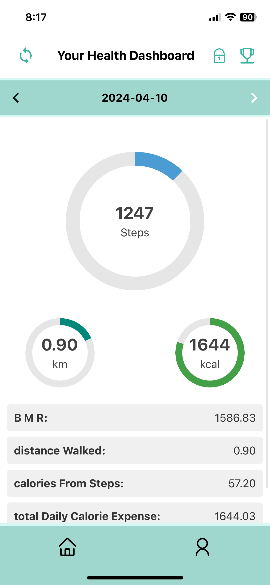

# Prototype Report for the Stealth Health System

## Introduction
### **Overview of the system**: 
Stealth Health is a health and fitness application that aims to provide privacy-focused health tracking and analytics to users. The system is designed to collect and analyze user health data while prioritizing user privacy and data security. The Stealth Health system includes features such as activity tracking, heart rate monitoring, sleep analysis, and water intake monitoring. The system also allows users to set fitness goals and track their progress while ensuring that users have full control over their data and can make informed decisions about its use. 
Stealth Health is a health and fitness application that aims to provide privacy-focused health tracking and analytics to users. The system is designed to collect and analyze user health data while prioritizing user privacy and data security. The Stealth Health system includes features such as activity tracking, heart rate monitoring, sleep analysis, and water intake monitoring. The system also allows users to set fitness goals and track their progress while ensuring that users have full control over their data and can make informed decisions about its use. 

### **Purpose and Scope**: 
The development of the Fitbit app prototype serves as a proof of concept for a more privacy-centric approach to personal health and fitness monitoring. Our scope is to demonstrate the feasibility of securely managing health data whilst providing users with insightful analytics on their physical activities and health metrics. 
The development of the Fitbit app prototype serves as a proof of concept for a more privacy-centric approach to personal health and fitness monitoring. Our scope is to demonstrate the feasibility of securely managing health data whilst providing users with insightful analytics on their physical activities and health metrics. 

## Research Method
- **Technical Literature Review**
  - Review of existing Fitbit app
- **Literature Search**
  - Investigation into reported privacy concerns within fitness tracking applications.
- **Privacy Notices Review**
  - Detailed analysis of Fitbit’s privacy policy and data handling practices from a privacy standpoint.

## Implementation Details

### Rationale for Selecting React Native

We chose React Native for our Fitbit app prototype due to its cross-platform capabilities [^1], as the  code that can be deployed on both iOS and Android devices. Our group members use both kind of devices, and we wanted to ensure that the app would be accessible to all team members during the development process and showcase applicability for both OS's. Additionally, React Native also has an extensive documentation and a large online community, which will be useful for troubleshooting and support since none of our team members had prior experience with mobile app development [^2]. Our team has also had previous experience developing in React, which made the transition to React Native smoother.


### Rationale for Selecting Expo

Expo is a comprehensive framework for developing React Native applications. We picked it for the following reasons:
- Expo provides libraries we found useful for our app, such as `SecureStore`[^3] for secure data storage and `LocalAuthentication`[^4] for biometric authentication. 
- It is open-source with a large community of developers, which we found helpful as beginners to mobile app development.[^5]
- It is a test-friendly platform; We each downloaded the Expo Go app, which allows us to preview the app on real devices during development.

#### Evaluation of Expo's Privacy Policies and Open-Source Nature

Expo seems to be committed to privacy, on its website it showcases its GDPR, CCPA, and Privacy Shield compliance, it says to be responsibly handling both developer and end-user data. We read through their Privacy Policy, updated on June 22nd, 2022, and their further explained privacy exposition dated February 7th, 2020.


- **Data Collection and Use**: "When you create an account on Expo or use our tools and services, we collect data including your name, email, and, if you enable paid services, your billing information... This data helps us make decisions about our products and services, in addition to allowing us to deliver satisfactory user experiences." (Expo, Privacy Policy [^6])


- **Data Processor and Controller Roles**: "When a developer uses Expo's services to create an app and distributes it to their users (end-users), we become a data processor because we process end-user data on behalf of the developer." (Expo, Privacy Explained [^7])


- **End-User Data Minimalism**: "When end-users use apps built by Expo, we collect very little end-user data. The data we may collect includes the end-user's push token... These requests do not contain identifying information such as unique device identifiers." (Expo, Privacy Explained [^7])


- **Security and Compliance**: The explicit statement is that Expo is "GDPR-, CCPA-, and Privacy Shield-compliant" in all scenarios which is a good indicator for a robust framework for privacy and data protection.


#### Open-Source Contribution
Expo's open-source ecosystem is important, it offers transparency and community engagement that is important for our project baseline. 

### Database Structure and Data Encryption

#### What Type of Data We Collect and How It Is Organized

In our application, user data is categorized into three distinct types: Sensitive Data, Daily Data, and User Preferences and Goals. We also incorporate user consent flags for data collection and offer customizable data retention periods.


- **Sensitive Data**: Securely stored using Expo's `SecureStore` and encrypted with `Crypto`, this category includes:
  - Age Range (e.g., "18-29", "30-39", etc.)
  - Gender (Options: "Male", "Female", "Other")
  - Height (cm)
  - Weight (kg)
  - Fitness Goals

- **Daily Data**: Collects day-to-day metrics for monitoring health and activity, including:
  - Daily Steps
  - Heart Rate (BPM)
  - Blood Pressure (mmHg)
  - Sleep Patterns (Hours)
  - Water Intake (ml)
  - Activity Tracking (Type and duration of physical activities)

- **User Preferences and Goals**: Stores goals and preferences to personalize the user experience. Data includes:
  - Daily Steps Goal
  - Daily Distance Goal (Km)
  - Daily Calories Burn Goal
  - Data Collection Flags: Boolean flags to indicate the user's consent for collecting specific metrics (`dailySteps`, `heartRate`, `bloodPressure`, `sleepPatterns`, `waterIntake`, `activityTracking`).
  - Data Retention Period: The duration for which the user wishes to retain their data, ranging from "3 Days" to "1 Year".

Sensitive data is encrypted and stored locally to prevent malicious access. Daily data collection is mapped on the users' data collection consent, users can control what information will be prompted from them. User preferences, including goals and data retention settings, are customizable at all times, allowing them to define their interaction with the app and how long their data is stored.

#### Choosing the Right Storage Solution

When selecting a storage solution for our application, we evaluated various options. We first looked at expo SQLite library for its easy use. The issue with it is that the database would be queried through a Web-Based API, going against our principle of having a non server stored database,due to the inherent risks of server-side data breaches and unauthorized access.[^8]
Furthermore, we were concerned by SQLite due to its limited support for built-in encryption. Ensuring the privacy and security of user data is paramount in our application; thus, we sought a solution that offered robust encryption capabilities out of the box.

#### SecureStore for Sensitive Permanent and Semi-Permanent Information

As mentioned earlier we used Expo's SecureStore for storing sensitive personal information. SecureStore offers an encrypted key-value store, which provides multiple advantages:

- **Encryption by Default**: the library automatically encrypts data before it is saved, providing encryption at rest without the need for additional encryption layers.

- **Ease of Use**: intuitive API for storing and retrieving encrypted data. 

- **Platform Security Features**: Uses the security features of the device's platform, offering a level of security that is consistent with the device's overall security.


Other notable functionalities of SecureStore are:

- **Data Isolation**: It ensures data is stored within the app's sandbox, preventing access by other apps and safeguarding against unauthorized data breaches.

- **easy Dynamic Management**: The following segments of our code demonstrate how we securely handle user data, such as age range, gender, height, weight, and fitness goals.

    ```javascript
    export const getPersonalInfo = async () => {
  // Define the keys for the personal information we want to retrieve
  const keys = ['ageRange', 'gender', 'height', 'weight', 'fitnessGoals'];
  const info = {};
  
  // Iterate over the keys, retrieving each piece of information from SecureStore
  // and adding it to the info object. This demonstrates how SecureStore can be used
  // to securely retrieve encrypted data.
  for (const key of keys) {
    const value = await SecureStore.getItemAsync(key);
    info[key] = value;
  }
  return info: };
 
 To update their data, users go through functions that retrieve their current data ( using getPersonalInfo), allow them to make changes, and then save these updates back to the device securely ( using savePersonalInfo) new information will overwrite the previous one, no history of the old data is kept within our software. If a user chooses to delete their data, our application uses SecureStore's deleteItemAsync for each data point, ensuring all personal information is removed from the device. This maintains data security and gives users complete control over their information.

#### Encryption and Decryption Methodology for daily data
We employ a dynamic encryption key generation strategy using `expo-crypto`'s SHA256 function[^9]. This choice is driven by SHA256's cryptographic security, it is a strong hash function that is resistant to collision attacks [^10]. The code snippet below showcases the process:

```javascript
import * as Crypto from 'expo-crypto';

export const generateAndStoreKey = async () => {
  const uniqueSeed = `${new Date().toISOString()}${Math.random()}`;
  const encryptionKey = await Crypto.digestStringAsync(
    Crypto.CryptoDigestAlgorithm.SHA256,
    uniqueSeed,
    { encoding: Crypto.CryptoEncoding.HEX }
  );
  await SecureStore.setItemAsync('encryptionKey', encryptionKey);
};
```

- **Usage of SHA256**:  We chose this algorithm for its widespread acceptance as a secure algorithm, it provides a good balance between speed and security.
- **Unique Seed Generation**: Combining the current ISO date string with a random number ensures that the seed for our hash is highly unpredictable, making the encryption key harder to guess.
- **Secure Storage of Key**: The resulting encryption key, is stored securely using expo-secure-store for the reasons mentioned in the above section (isolating it within the device's secure storage and ensuring it's not accessible without authentication).

We then encrypt the health metrics using the AES encryption function provided by CryptoJS [^11]. AES is particularly suitable for mobile environments where computational resources are limited as it can encrypt large amounts of data quickly. Below is the implementation detail:

```javascript
import * as FileSystem from 'expo-file-system';
import CryptoJS from 'react-native-crypto-js';
import { getEncryptionKey } from './SecureStoreService';

const dailyDataDirectory = `${FileSystem.documentDirectory}dailyData/`;

export const saveDailyData = async (data, date) => {
    const encryptionKey = await getEncryptionKey();
    const ciphertext = CryptoJS.AES.encrypt(JSON.stringify(data), encryptionKey).toString();
    const filePath = dailyDataDirectory + `${date}.json`;

    await FileSystem.writeAsStringAsync(filePath, ciphertext);
};
```
- **JSON Stringification**: Before encryption, the data is stringified to ensure compatibility with the encryption library, as CryptoJS operates on string inputs.
- **JSON Stringification**: Before encryption, the data is stringified to ensure compatibility with the encryption library, as CryptoJS operates on string inputs.
- **File System Storage**: The Encrypted data is stored in the device's file system, under a directory specific to daily data, to ease future data retrieval.
- **Using the Date as Filename**: Storing daily data in files named after the date simplifies retrieval and management. It enables straightforward data purging based on retention policies without the need to decrypt files to assess their contents.
- **Security Implications of Filename Choice**: The use of dates as filenames does not significantly impact security. The critical security measure lies in the encryption of the file's contents. However, a discussion around encrypting filenames could be justified in contexts where the mere knowledge of a user's activity on specific dates needs to be hidden.
- **FileSystem vs. SecureStore**: Data is encrypted and stored in the file system rather than SecureStore due to size limitations and performance considerations. SecureStore is designed for small pieces of data like keys or tokens, while the FileSystem API is optimized for larger data storage and offers more flexibility for managing files.


Retrieving and decrypting daily data process: 
```javascript
export const getDailyData = async (date) => {
    const encryptionKey = await getEncryptionKey();
    const filePath = dailyDataDirectory + `${date}.json`;
    const encryptedData = await FileSystem.readAsStringAsync(filePath);
    const bytes = CryptoJS.AES.decrypt(encryptedData, encryptionKey);
    const decryptedData = JSON.parse(bytes.toString(CryptoJS.enc.Utf8));

    return decryptedData;
};
```
- **Secure Key Retrieval**: The encryption key is fetched securely from expo-secure-store for use in the decryption process.
- **Decryption Process**: CryptoJS's AES.decrypt method is used to decrypt the data. This step requires the same key used for encryption, ensuring that only authorized users can access the data.
- **Parsing Decrypted Data**: The decrypted string is parsed back into a JSON object, making it readily usable by the application.
- **Using the Date as Filename**: Storing daily data in files named after the date simplifies retrieval and management. It enables straightforward data purging based on retention policies without the need to decrypt files to assess their contents.
- **Security Implications of Filename Choice**: The use of dates as filenames does not significantly impact security. The critical security measure lies in the encryption of the file's contents. However, a discussion around encrypting filenames could be justified in contexts where the mere knowledge of a user's activity on specific dates needs to be hidden.
- **FileSystem vs. SecureStore**: Data is encrypted and stored in the file system rather than SecureStore due to size limitations and performance considerations. SecureStore is designed for small pieces of data like keys or tokens, while the FileSystem API is optimized for larger data storage and offers more flexibility for managing files.


Retrieving and decrypting daily data process: 
```javascript
export const getDailyData = async (date) => {
    const encryptionKey = await getEncryptionKey();
    const filePath = dailyDataDirectory + `${date}.json`;
    const encryptedData = await FileSystem.readAsStringAsync(filePath);
    const bytes = CryptoJS.AES.decrypt(encryptedData, encryptionKey);
    const decryptedData = JSON.parse(bytes.toString(CryptoJS.enc.Utf8));

    return decryptedData;
};
```
- **Secure Key Retrieval**: The encryption key is fetched securely from expo-secure-store for use in the decryption process.
- **Decryption Process**: CryptoJS's AES.decrypt method is used to decrypt the data. This step requires the same key used for encryption, ensuring that only authorized users can access the data.
- **Parsing Decrypted Data**: The decrypted string is parsed back into a JSON object, making it readily usable by the application.

#### Storage of user data management preferences and fitness goals
For storing user preferences regarding data management and fitness goals, our application adopts a pragmatic approach that emphasizes user experience and operational efficiency. Unlike the highly sensitive user data which is encrypted and stored securely, this category of data, while important, does not include personally identifiable information that could compromise user privacy if accessed. Therefore, we have opted not to encrypt this data for several reasons:

- **Rapid Access**: These preferences are frequently accessed and modified within the application's UI. Non-encrypted storage facilitates faster retrieval and updating of these preferences, enhancing the app's performance and user experience.
- **Simplicity**: By avoiding encryption for this category of data, we reduce the complexity of our data handling processes. This simplification helps in maintaining a cleaner codebase and minimizes potential errors in encryption and decryption operations.
- **Data Nature**: The nature of this data is such that it does not pose a significant privacy risk. Preferences and goals are generic and do not reveal sensitive personal information.

### Storage Implementation

User preferences and fitness goals are stored in the device's file system. This decision is based on the need for persistent storage that can easily accommodate the structure and size of the data. The following code snippets demonstrate how we manage these preferences:

```javascript
export const savePreferences = async (preferences) => {
  const data = JSON.stringify(preferences);
  await FileSystem.writeAsStringAsync(preferencesFileUri, data);
};

export const getPreferences = async () => {
  const fileInfo = await FileSystem.getInfoAsync(preferencesFileUri);
  if (!fileInfo.exists) {
    // If no preferences file exists, initialize with default values
    const defaultPreferences = {};
    await savePreferences(defaultPreferences);
    return defaultPreferences;
  }
  const data = await FileSystem.readAsStringAsync(preferencesFileUri);
  return JSON.parse(data);
};

```

Similarly, user consent flags for data collection are managed through straightforward read/write operations in the file system:

```javascript
export const saveDataCollectionFlags = async (flags) => {
  const data = JSON.stringify(flags);
  await FileSystem.writeAsStringAsync(dataCollectionFlagsUri, data);
};

export const getDataCollectionFlags = async () => {
  const fileInfo = await FileSystem.getInfoAsync(dataCollectionFlagsUri);
  if (!fileInfo.exists) {
    // Initialize with default flags if the file doesn't exist
    const defaultFlags = {};
    await saveDataCollectionFlags(defaultFlags);
    return defaultFlags;
  }
  const data = await FileSystem.readAsStringAsync(dataCollectionFlagsUri);
  return JSON.parse(data);
};


```
We decided not to encrypt user preferences and fitness goals for a simple reason: it keeps the app fast and easy to use. This data isn't as sensitive as health metrics, so we chose a more straightforward approach. However, we're ready to ramp up security if needed. This decision was all about finding the right balance—keeping the app smooth and user-friendly, without painting ourselves into a corner security-wise. We've set things up so we can switch on encryption for this data down the line, should the need arise.
#### Storage of user data management preferences and fitness goals
For storing user preferences regarding data management and fitness goals, our application adopts a pragmatic approach that emphasizes user experience and operational efficiency. Unlike the highly sensitive user data which is encrypted and stored securely, this category of data, while important, does not include personally identifiable information that could compromise user privacy if accessed. Therefore, we have opted not to encrypt this data for several reasons:

- **Rapid Access**: These preferences are frequently accessed and modified within the application's UI. Non-encrypted storage facilitates faster retrieval and updating of these preferences, enhancing the app's performance and user experience.
- **Simplicity**: By avoiding encryption for this category of data, we reduce the complexity of our data handling processes. This simplification helps in maintaining a cleaner codebase and minimizes potential errors in encryption and decryption operations.
- **Data Nature**: The nature of this data is such that it does not pose a significant privacy risk. Preferences and goals are generic and do not reveal sensitive personal information.

### Storage Implementation

User preferences and fitness goals are stored in the device's file system. This decision is based on the need for persistent storage that can easily accommodate the structure and size of the data. The following code snippets demonstrate how we manage these preferences:

```javascript
export const savePreferences = async (preferences) => {
  const data = JSON.stringify(preferences);
  await FileSystem.writeAsStringAsync(preferencesFileUri, data);
};

export const getPreferences = async () => {
  const fileInfo = await FileSystem.getInfoAsync(preferencesFileUri);
  if (!fileInfo.exists) {
    // If no preferences file exists, initialize with default values
    const defaultPreferences = {};
    await savePreferences(defaultPreferences);
    return defaultPreferences;
  }
  const data = await FileSystem.readAsStringAsync(preferencesFileUri);
  return JSON.parse(data);
};

```

Similarly, user consent flags for data collection are managed through straightforward read/write operations in the file system:

```javascript
export const saveDataCollectionFlags = async (flags) => {
  const data = JSON.stringify(flags);
  await FileSystem.writeAsStringAsync(dataCollectionFlagsUri, data);
};

export const getDataCollectionFlags = async () => {
  const fileInfo = await FileSystem.getInfoAsync(dataCollectionFlagsUri);
  if (!fileInfo.exists) {
    // Initialize with default flags if the file doesn't exist
    const defaultFlags = {};
    await saveDataCollectionFlags(defaultFlags);
    return defaultFlags;
  }
  const data = await FileSystem.readAsStringAsync(dataCollectionFlagsUri);
  return JSON.parse(data);
};


```
We decided not to encrypt user preferences and fitness goals for a simple reason: it keeps the app fast and easy to use. This data isn't as sensitive as health metrics, so we chose a more straightforward approach. However, we're ready to ramp up security if needed. This decision was all about finding the right balance—keeping the app smooth and user-friendly, without painting ourselves into a corner security-wise. We've set things up so we can switch on encryption for this data down the line, should the need arise.

### Data Analytics and Privacy Implications

#### **Algorithms for Health Data Analysis**:
   - **BMI (Body Mass Index) Calculation**: This algorithm calculates BMI based on the user's weight (in kilograms) divided by the square of their height (in meters). It provides an estimate of body fatness.
   - **BMR (Basal Metabolic Rate) Calculation**: BMR is calculated using formulas such as the Harris-Benedict equation, taking into account factors like weight, height, age, and gender. It estimates the number of calories burned at rest.
   - **Distance Walked Estimation**: This algorithm estimates the distance walked based on the number of daily steps taken, the user's height, and gender-specific stride lengths. 
   - **Calories Burned Calculation**: Calories burned are calculated based on activities performed, their durations, MET (Metabolic Equivalent of Task) values, and the user's weight.
   - **Hydration Level Estimation**: This algorithm estimates hydration levels by comparing actual water intake against recommended levels, considering factors like weight, exercise hours, and activity intensity.
   - **Stress Level Indication**: Stress levels are assessed based on heart rate variability, sleep patterns, and activity levels. Elevated heart rates and disrupted sleep can indicate increased stress.
   - **Health Risk Indicator**: This algorithm evaluates health risks like hypertension and type 2 diabetes based on BMI and blood pressure readings, incorporating medical guidelines to identify risk levels.

#### **On Privacy Implications of Data Analytics**:
   - User data preferences directly impact user privacy by influencing the scope and depth of health data collection and analysis. The more data points collected, the more comprehensive the health insights generated, but this also raises privacy concerns. Thus, we give users granular control over data collection to ensure their privacy preferences are respected.
   - Respecting user preferences ensures that the application only processes and computes metrics based on the data explicitly permitted by the user. This is done to reduce privacy risks associated with unauthorized data usage.
   - Metrics that are not enabled by the user are not computed, and will not be rendered in the app's interface.
   - For example, if a user opts not to enter their weight, the BMI calculation will not be performed, ensuring that no health insights are generated without the user's explicit consent.

#### **Logic for Computing Metrics based on User Data**:
The logic for computing metrics in the provided code involves several key steps and considerations, all of which are designed to ensure that only relevant metrics are computed based on user preferences. 

- **Data Availability Check:** Before computing any metrics, the code checks the availability of essential data which are crucial for various health computations. If any of these data points are missing due to user preferences, the algorithm skips the computation of related metrics. 

  - Example: In the computeAndStoreMetrics function, there are checks like if (!dailyData || !personalInfo || !encryptionKey) to ensure that necessary data for computation, such as daily data, personal information, and encryption keys, are available.

- **User Preference Validation:** The code verifies user preferences to determine which metrics should be computed based on what the user has opted to track or monitor.

  - Example: In the HealthMetrics component, each metric (e.g., daily steps, heart rate) is associated with a switch that users can toggle on or off. The toggleSwitch function is called when a user toggles a switch, updating the corresponding metric state. For instance:
    ```javascript
      const toggleSwitch = async (metric) => {
      const updatedMetrics = { ...metrics, [metric]: !metrics[metric] };
      await saveDataCollectionFlags(updatedMetrics);
      setMetrics(updatedMetrics);
    };
    ```
    This function toggles the state of a metric based on user input, ensuring that only metrics with toggled switches are considered for computation.
    
- **Conditional Metric Computation:** Metrics are computed conditionally based on whether the necessary data is available and the corresponding user preference is enabled.

  - Example: In the computeAndStoreMetrics function, there are conditional computations like calculating BMI, BMR, calories burned from steps, hydration level, stress level, etc., only if the required data and user preferences indicate tracking those metrics.

- **Dynamic Functionalities Based on Preferences:** The code dynamically determines available functionalities based on user preferences and computed metrics, providing explanations for each functionality.

  - Example: The computeAvailableFunctionalities function generates an array of available functionalities and their explanations based on the metrics that users have enabled. This array is used to render functionalities in the app's interface as users toggle switches on or off, to provide them with information on how each metric is computed.


### User Interface Design and Data Input

Our application is designed to offer users flexibility in how they synchronize their health data. Currently, we provide manual data input functionality, with future plans to integrate automatic sync options like Fitbit. This approach is due to the current limitation of accessing developer-specific features from external APIs.

#### Manual Data Input

The manual input feature allows users to log health metrics directly into the app, promoting engagement and personal responsibility in health tracking. This feature is user-friendly and ensures that users without access to wearable health devices can still participate actively in managing their health data.

The app dynamically renders input fields based on the user's data collection preferences, stored in `flags`. This ensures that only relevant data fields are presented to the user, making the UI more personal. For instance, if a user opts to track their water intake but not their sleep patterns, the interface will adjust accordingly to reflect this preference.

```javascript
const renderInputField = (flag, placeholder, name) => (
  flags[flag] && (
    <View style={styles.inputGroup}>
      <TextInput
        placeholder={placeholder}
        value={dailyData[name]}
        onChangeText={(value) => handleInputChange(name, value)}
        keyboardType="numeric"
        style={styles. input}
      />
    </View>
  )
);
```
Upon data entry, the saveAndExit function is triggered, securely storing the day's data and computing metrics based on the inputs. This method utilizes saveDailyData from the backend, which encrypts and saves the data locally, and computeAndStoreMetrics for real-time analytics. This ensures data privacy while enabling immediate feedback on health trends.

```javascript
const saveAndExit = async () => {
  if (dataChanged) {
    const today = new Date().toISOString().split('T')[0];
    await saveDailyData(dailyData, today);
    await computeAndStoreMetrics(today);
    Alert.alert("Data Saved", "Your daily data and computed metrics have been saved.");
    navigation.goBack();
  }
};
```
The feature allows for detailed activity tracking, letting users log specific exercises along with their duration. This data enriches the user's health profile and provides deeper insights into their physical activities. A future enhancement could involve storing detailed activity logs in a separate file for historical analysis, potentially fetched and decrypted using methods similar to those employed in daily data management. For extended data sets, the approach would involve serializing the activity logs and storing them in a dedicated file within the app's local storage. Retrieving this data would require decrypting the content and parsing it back into a usable format, akin to the method used for daily metrics.
#### Simulation for Future Integration

Although direct integration with health devices is part of our future roadmap, we've included a simulated function in the prototype to demonstrate how seamless data integration could look. This simulation mimics the data structure from a real API call, preparing us for eventual real-world application and integration.

The first step involves establishing a connection to the Fitbit API to retrieve user activity data. This process is simulated in the provided code but, in practice, requires OAuth authentication to securely access the user's Fitbit account data.

```javascript
const simulateDataFetch = async () => {
  setIsLoading(true);
  setIsBluetoothEnabled(true); // Enable Bluetooth for real-world device connectivity
  // Simulated delay to mimic the API call to Fitbit
  setTimeout(() => {
    // In a real scenario, this would be replaced with an API call to Fitbit
    setFitbitData(mockFitbitData);
    setIsLoading(false);
    setIsBluetoothEnabled(false); // Disable Bluetooth post-sync
  }, 2000);
};
```

Once the data is fetched, it's crucial to integrate it with the existing user data within the application. This step involves parsing the activity data, conforming it to the application's data model, and ensuring that new data complements rather than duplicates existing records.
```javascript
const mergeActivitiesWithExistingData = async (fitbitData) => {
  const today = new Date().toISOString().split('T')[0];
  let existingData = await getDailyData(today) || {};
  // Converting and merging Fitbit data with the application's format
  const updatedData = {
    ...existingData,
    activityTracking: [...(existingData.activityTracking || []), ...convertFitbitData(fitbitData)],
  };
  await saveDailyData(updatedData, today);
};
```
- With this we ensure that the integrated data adheres to the application's data structure, facilitating seamless user experiences across different data sources. We also implement checks to prevent overlapping data entries, maintaining the integrity and utility of the health metrics recorded.

-  A critical aspect of integrating third-party data is ensuring that users retain control over their information. This involves allowing users to review, edit, or remove imported data before it is permanently stored. All data, once approved for syncing, is encrypted and stored securely to protect user privacy and ensure compliance with relevant data protection laws.

The process outlined not only demonstrates the technical feasibility of integrating Fitbit data into a mobile application but also underscores the importance of user privacy and control. The simulated API calls and data processing logic serve as a foundation for developing a fully functional integration, ready to adapt to real API responses and handle user data with the utmost care.
### Data Management and User Control. 

#### User-Defined Data Retention Periods
As explained before, users can specify how long their data should be stored through a selection of predefined periods, ranging from "3 Days" to "1 Year". This preference impacts when data is automatically deleted to respect user privacy and manage device storage effectively.
After selecting a data retention period, the choice is stored using the expo-file-system module, enabling persistent preferences across app sessions. Here's how preferences are saved:
```javascript
export const savePreferences = async (preferences) => {
  const data = JSON.stringify(preferences);
  await FileSystem.writeAsStringAsync(preferencesFileUri, data);
};
```
This function serializes the user's preferences to a JSON string and writes it to a file within the device's file system, ensuring preferences are retained even after the app is closed.
If notifications are enabled, the application schedules reminders for users to manage their data before the chosen retention period ends. This approach ensures users are always informed about their data lifecycle, it listens for changes in notificationsEnabled and dataRetention, scheduling or adjusting notifications accordingly.:
```javascript
useEffect(() => {
  if (notificationsEnabled) {
    scheduleDeletionNotification(dataRetention);
  }
}, [notificationsEnabled, dataRetention]);

```
We perform automatic data deletions based on the user-defined retention period. Each time the app is launched, it evaluates stored data against the current retention policy, retrieving the user's retention preference, calculating the cutoff date, and iterating through stored files, deleting those older than the active cutoff date :
```javascript
export const checkAndDeleteOldFiles = async () => {
  const preferences = await getPreferences();
  const retentionDays = getRetentionDays(preferences.dataRetention);
  const cutoffDate = subDays(new Date(), retentionDays);

  const files = await FileSystem.readDirectoryAsync(dailyDataDirectory);
  files.forEach(async (fileName) => {
    const fileDate = new Date(fileName.split('.')[0]);
    if (fileDate < cutoffDate) {
      await FileSystem.deleteAsync(`${dailyDataDirectory}${fileName}`);
    }
  });
};
```
If a user chooses to change their data retention period, the application dynamically adjusts to delete old data if necessary and updates notifications as such. It also ensures that users are alerted about potential data loss when decreasing the retention period, providing an additional layer of user control and transparency.

```javascript
const handleDataRetentionChange = async (newOption) => {
  const newRetentionDays = getRetentionDays(newOption);
  if (newRetentionDays < getRetentionDays(dataRetention)) {
    // Confirm with user before deleting old data
    confirmDeletion().then(() => updateRetentionPreference(newOption));
  } else {
    updateRetentionPreference(newOption);
  }
};

const updateRetentionPreference = async (newOption) => {
  setDataRetention(newOption);
  await savePreferences({ dataRetention: newOption, notificationsEnabled });
  checkAndDeleteOldFiles();
};
```
#### PDF retrieval
 Providing users with the ability to retrieve their health data in PDF format is a crucial feature that aligns with our commitment to data transparency, user control, and data minimization principles. This functionality allows users to generate a comprehensive report of their health metrics and computed analytics over a specified data retention period, ensuring they have tangible access to their information and further empowering them with their data management.

 The initial step involves aggregating the user's health metrics and computed data into a structured HTML format. This process accounts for the user-defined data retention period, ensuring the report only encompasses data within this timeframe, aligning with our data minimization policy.


```javascript
const createHtmlForPDF = async () => {
  // Logic to calculate start date based on retention period
  let html = "<html><head><title>Daily Data and Computations</title></head><body>";
  html += "<h1>Daily Data and Computations</h1>";
  // Iteration over each day within the retention period to compile data
  return html + "</body></html>";
};
```
Here we dynamically adjust the report's content based on the user's set data retention period. The use of HTML to format the report makes it easy to convert into PDF.
#### Delete all function
Another crucial feature we provide users, is the ability to delete all their data any time they want. The feature is enabled by a clear, simple, and highly accessible "Delete Everything" button in the user's profile settings page. When this button is pressed, all of the user's data (which is stored locally) is deleted and the application redirects to the new user setup page. If the user has authentication enabled, authentication is required before their data can be deleted. 

To delete all of the user's data, the three types of storage we used for our application must be cleared. 

```javascript
export async function deleteAll() {
    const dailyDataDirectory = `${FileSystem.documentDirectory}dailyData/`;
  
    try {
      await SecureStore.deleteItemAsync('ageRange');
      await SecureStore.deleteItemAsync('gender');
      await SecureStore.deleteItemAsync('height');
      await SecureStore.deleteItemAsync('weight');
      await SecureStore.deleteItemAsync('dailySteps');
      await SecureStore.deleteItemAsync('dailyDistance');
      await SecureStore.deleteItemAsync('dailyCalories');

      await FileSystem.deleteAsync(dailyDataDirectory, { idempotent: true });

      await AsyncStorage.clear(); 
      
      return true;
    } catch (error) {
      console.error("An error occurred during deletion:", error);
      Alert.alert("Deletion Failed. Please try again.");
      return false;
    }
  }
```
In this function, we first delete all data stored in SecuredStore using SecureStore.deleteItemAsync(key) which deletes the value associated with the provided key. 

Next, we delete the data stored in the device's filesystem using FileSystem.deleteAsync(fileUri, options). Here, we delete the directory which contains all the files about a user's fitness data. 

Finally, we clear the AsyncStorage using AsyncStorage.clear(). AsyncStorage is unencrypted, asynchronous, persistent, key-value storage system that is global to the application. We used AsyncStorage to store data that we deem does not require encryption, such as is authentication enabled/disabled, or is the user setup complete/incomplete. 


### Authentication and Data Protection
We also implemented a feature to allow users to protect their data using biometric authentication. Authentication is optional and can be enabled/disabled during the app setup or later on in the user's profile settings page. If enabled, authentication is used to authenticate a user upon opening the application or before deleting all user data. 

This feature is enabled by Expo LocalAuthentication, an open-source library for implementing FaceID, TouchID (iOS) or Fingerprint (Android) to authenticate users. 

Our authentication setup page consists of checking if biometrics is supported on the device and if so, a user can toggle between authentication on/off which saves the preferences in the AsyncStorage. 

```javascript
const [isBiometricSupported, setIsBiometricSupported] = useState(false);
const [authenticationEnabled, setAuthenticationEnabled] = useState(false);
// check if device supports biometrics
useEffect( () => {
    (async () => {
    const compatible = await LocalAuthentication.hasHardwareAsync();
    setIsBiometricSupported(compatible);
    }) ();
});

const toggleSwitch = async () => {
    if (!isBiometricSupported) {
      Alert.alert(
        "Unsupported Feature",
        "Your device does not support Face ID.",
        [
          { text: "OK" }
        ]
      );
    } else {
        const previousState = !authenticationEnabled;
        setAuthenticationEnabled(previousState);
        await AsyncStorage.setItem('authenticationEnabled', JSON.stringify(previousState));
    }
  };
```
When users have authentication enabled, they need to be authenticated before accessing the Landing Page.
```javascript
const [isAuthenticated, setIsAuthenticated] = useState(false);
  const navigation = useNavigation();
  

  useEffect(() => {
      if (isAuthenticated) {
        navigation.navigate('LandingPage');
      }
    }, [isAuthenticated]);


  function onAuthenticate () {
      const auth = LocalAuthentication.authenticateAsync({
      promptMessage: 'Authenticate',
      fallbackLabel: 'Enter Password',
      });
      auth.then(result => {
      setIsAuthenticated(result.success);
      });
  }
```


## Conclusions
- **Summary of Key Findings**: Concise overview of the significant outcomes from this prototype development.
- **Insights on Privacy Design Strategies Implemented**: Discussion on the application of Minimize, Separate, Abstract, and Hide strategies.
- **Lessons Learned and perspectives**: Key takeaways from incorporating privacy-by-design principles in the Fitbit app development process.
- **Lessons Learned and perspectives**: Key takeaways from incorporating privacy-by-design principles in the Fitbit app development process.

## Appendix
- **How to Run the App**:
  You must have these following requirements:
  - Latest version of the Node.js: https://nodejs.org/ installed
  - Yarn: https://yarnpkg.com/ or npm: https://www.npmjs.com/ installed
  - EXPO installed, (https://expo.dev/) by running `npm install -g expo-cli`

  After these requirements are met, you can clone the codebase, get to your local cloned project directory, and run:
  - npm install
  - expo start

  If you are prompted to update anything when you run these commands, please update, and run the above commands again. 

- **Screenshot and details of every page of the app**: 
  - Authenticate.js screen, under the screens directory:

    
    

  - IntroPage.js screen, under the screens/privacyPolicies directory:

    

  - IntroPolicy.js screen, under the screens/privacyPolicies directory:

    

  - PrivacyPolicySimplified.js screen, under the screens/privacyPolicies directory:

     

  - UserProfileData.js screen, under the screens directory:
    
    

  - HealthMetrics.js screen, under the screens directory:

    

  - SetupAuth.js screen, under the screens directory:

    

  - DataManagement.js screen, under the backend directory:
   
    
    
  - TermsOfServicePopup.js screen, under the screens directory:

    

  - LandingPage.js screen, under the screens directory:
  
    

  - PersonalPage.js screen, under the screens directory:
  
    

  - PersonalPage.js screen, under the screens directory:
  
    

  - PrivacyPolicyText.js screen, under the screens/privacyPolicies directory:
  
    

  - ProfileManage.js screen, under the screens directory:
  
    

  - UserGoalsPage.js screen, under the screens directory:
  
    

  - SyncPage.js screen, under the screens directory:
  
    
  
  - ManualInputPage.js screen, under the screens directory:
  
    

  - WatchInputPage.js screen, under the screens directory:
  
    

- **Technical Specifications and Documentation**: 
  All functions inputs and outputs, as well as more descriptive inline comments can be found in the codebase. 

  
## Footnotes
[^1]: React native documentation: [React native elements](https://reactnativeelements.com/docs)
[^2]: Stack exchange questions pertaining to React-Native ( over 9000 results): [questions tagged react native](https://stackoverflow.com/questions/tagged/react-native)
[^3]: Expo Documentation: [Secure Store](https://docs.expo.dev/versions/latest/sdk/securestore/)
[^4]: Expo Documentation: [Local Authentification](https://docs.expo.dev/versions/latest/sdk/local-authentication/)
[^5]: Expo FAQ: [expo is open source](https://docs.expo.dev/faq/)
[^6]: Expo Documentation: [Privacy policy](https://expo.dev/privacy)
[^7]: Expo Documentation: [Privacy explained](https://expo.dev/privacy-explained)
[^8]: American Heart Association. "Target Heart Rates Chart." [Link to AHA Heart Rates](https://www.heart.org/en/healthy-living/fitness/fitness-basics/target-heart-rates)
[^9]: Centers for Disease Control and Prevention (CDC). "About Adult BMI." [Link to CDC BMI](https://www.cdc.gov/healthyweight/assessing/bmi/adult_bmi/index.html)
[^10]: Mifflin, M.D., St Jeor, S.T., Hill, L.A., Scott, B.J., Daugherty, S.A., & Koh, Y.O. (1990). "A new predictive equation for resting energy expenditure in healthy individuals." The American Journal of Clinical Nutrition, 51(2), 241-247. [AJCN](https://academic.oup.com/ajcn/article-abstract/51/2/241/4695347)
[^11]: Sally Edwards. "The Heart Rate Monitor Book." Offers an in-depth guide to understanding and using heart rate monitors for training.[link](https://archive.org/details/heartratemonitor00edwa)
[^12]: Water Intake Formula: Based on general hydration guidelines from health organizations, such as the National Academies of Sciences, Engineering, and Medicine's recommendation on [Daily Water Intake](https://www.nap.edu/read/10925/chapter/1)
[^13]: Gadgetbridge: (https://gadgetbridge.org/)
[^14]: FitoTrack: (https://play.google.com/store/apps/details?id=de.tadris.fitness&hl=en_CA&gl=US&pli=1)
[^15]: After analysis of the [Fitbit API](https://dev.fitbit.com/build/reference/), we found that there were [several red flags](https://dev.fitbit.com/getting-started/) when trying to access their API. Developers need to create a Google account to access the API and link the Fitbit service to their account. Developers also need to download the Fitbit app on their phone and own a Fitbit device. To access the full developer suite, we also had to accept the [Fitbit Platform Terms of Service](https://dev.fitbit.com/legal/platform-terms-of-service/) and the [Fitbit App Distribution Agreement](https://dev.fitbit.com/legal/app-distribution-agreement/). We found in the first that "Fitbit may monitor your usage of the Fitbit APIs in order to improve the Fitbit Platform and to ensure compliance with our policies and applicable laws and regulations". In the App Distribution Agreement, we found that "Fitbit may collect and use certain logs, analytics, usage statistics, and other data from the Fitbit Products regarding usage of your App as described in the Fitbit Privacy Policy". All in all, we found this counterintuitive to our goal of maintaining our privacy and that of our stakeholders. 

-
